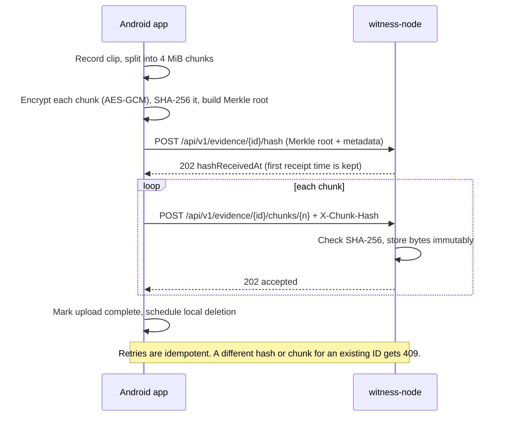

# Witness

An open-source, federated video evidence tool for citizen journalists documenting potential misconduct by authorities.

## Mission

Protect people who document injustice. Safety first, evidence second.

## Core Principles

- **Safety first** — The journalist's safety always takes priority over evidence capture
- **Open source** — Full transparency, community trust, not for profit
- **Decentralized** — Federated architecture with no single point of failure
- **Accessible** — Simple enough for anyone to use

## Demo

A phone registers the evidence hash, uploads an encrypted chunk, and a group operator confirms receipt. A second registration with a different hash is refused, so the original proof of existence can't be overwritten. (Real responses from a local `witness-node`; long hashes shortened for display.)


## How It Fits Together


The upload path, step by step:



| Component | Where | What it does |
|-----------|-------|--------------|
| Calculator disguise | `android/.../ui/camouflage/` | Launcher shows a working calculator; `1312=` opens Witness |
| Witness mode | `android/.../MainActivity.kt`, `domain/safety/` | Volume Up, Up, Down, Down arms covert recording; Volume Down cancels within 5 seconds |
| Capture | `android/.../service/capture/` | Foreground service recording video or audio, switching to audio-only on low battery |
| Encryption and hashing | `android/.../data/upload/CapturedEvidenceQueuer.kt`, `domain/verification/` | Chunks, encrypts, and hashes the clip, then deletes the plaintext recording |
| Upload and retention | `android/.../data/upload/` | WorkManager jobs that upload with backoff and clean up after confirmation |
| Backend node | `backend/` | Go HTTP API storing hashes, metadata, and encrypted chunks in SQLite and on disk |
| Deployment | `docker-compose.yml`, `deploy/` | Docker Compose with Caddy for HTTPS, plus a DigitalOcean cloud-init reference |

## Key Features (MVP)

- Video, audio, and photo capture with GPS metadata
- **Witness mode** — Covert recording with screen off
- **Camouflaged app** — Disguised as innocuous application
- **Federated upload** — Footage distributed across trusted nodes
- **Live streaming** — When connectivity allows
- **Offline resilient** — Queue and upload when connection restored
- **Anonymous accounts** — No identity required
- **Verification** — SHA-256 hash at capture for tamper-proof evidence
- **Low battery mode** — Adaptive quality for extended use

## Using the App

The Android app launches as a calculator. To open Witness, enter the secret calculator password:

```text
1312=
```

## Download APK

Pre-alpha APKs may be attached to [GitHub Releases](https://github.com/ChrisBrooksbank/witness/releases) for trusted testing.

Important:

- Install only APKs from official Witness releases.
- Verify the `.sha256` checksum when possible.
- GitHub APK installs do not provide app-store-style update management.
- A group APK must be built with that group's HTTPS backend URL.
- Pre-alpha APKs are not a substitute for legal advice or organizational security planning.

See [docs/releases/apk-distribution.md](docs/releases/apk-distribution.md) for the release process and signing requirements.

## Run A Group Backend

Witness includes a simple Docker-based backend for group deployments. A group operator can run it on a small server, point Android builds at its HTTPS URL, and confirm encrypted clip uploads through the verification endpoint.

The backend stores encrypted evidence chunks and verification metadata. It can confirm receipt and verify uploaded encrypted chunks, but it does not currently provide a video playback interface.

### What You Need

- A domain name, such as `witness.example.org`
- A small Ubuntu VPS with SSH access
- Docker and Docker Compose installed

### Set Your Domain

Create an `A` record for your backend domain that points to the server IP address. For example, point `witness.example.org` to your VPS.

### Copy The Config

On the server, copy the example environment file and edit it:

```bash
cp .env.example .env
```

Set `WITNESS_SERVER_NAME` to your domain. The default `WITNESS_DATA_DIR=./data` stores the SQLite database and encrypted chunks beside the compose file.

### Start The Backend

For a real group deployment with automatic HTTPS certificates:

```bash
docker compose up -d
curl https://witness.example.org/health
```

Expected response:

```json
{"status":"ok"}
```

For local emulator testing without HTTPS, leave `.env` absent or remove `COMPOSE_PROFILES=https` from it:

```bash
docker compose up -d
curl http://localhost:8080/health
```

Use `http://` only for emulator and local development. The compose file binds port `8080` to server-local `127.0.0.1`; real phone uploads should use the HTTPS domain through Caddy.

### Point The Android App At It

Debug builds default to the Android emulator backend URL:

```text
http://10.0.2.2:8080/
```

Release or group builds must set the backend URL:

```bash
cd android
./gradlew assembleRelease -PwitnessNodeBaseUrl=https://witness.example.org/
```

The release build fails if the URL is missing, uses the emulator or localhost default, is not HTTPS, or is missing the trailing slash.

### Record A Test Clip

Install the group build, open the calculator, enter `1312=`, record a short clip, and wait for upload. The current app upload queue retries when connectivity is unavailable.

### Confirm Receipt

Use the verification endpoint with the evidence ID:

```bash
curl https://witness.example.org/api/v1/evidence/{evidenceId}/verify
```

The response includes upload and verification state plus `encryptedBytesStored` for each chunk so operators can confirm the encrypted bytes are still present on disk after a restart.

Registered hashes and stored chunks are immutable. Retrying the same upload is safe and returns the original receipt time, but a different hash or chunk for an existing evidence ID is rejected with `409 Conflict`.

Evidence ID discovery in the app UI/logs is still early MVP work. Until that is polished, use Android logs while testing.

### Backups

The container fixes ownership of `./data` on start, so it can be created by Docker or by you.

Back up `./data`. It contains `witness.db` and encrypted chunk files. Losing this directory may lose uploaded evidence. Test restoring the directory before relying on a deployment.

### Troubleshooting

- If `/health` does not load, check `docker compose ps` and `docker compose logs witness-backend`.
- If HTTPS certificates are not issued, confirm the domain `A` record points to the server and ports `80` and `443` are reachable.
- If the app queue stays pending, confirm the Android build uses the same HTTPS base URL you are checking.
- If uploads fail, check that the server disk is not full and that `./data` is writable by Docker.

### Safety Notes

The backend operator should not be able to casually watch uploaded clips because uploaded chunks are encrypted before upload. Anyone operating a server should protect SSH keys, Docker access, backups, and admin accounts. Witness is not a substitute for legal advice or organizational security planning.

## Threat Model

Designed to protect against:
- Device seizure and destruction
- Footage deletion
- Server takedowns
- Network blocking
- Journalist identification and retaliation

## Status

Pre-alpha. The Android app records, encrypts, and uploads clips to a single group backend. Federation across multiple nodes, live streaming, and evidence playback aren't built yet.

See [specs/readme.md](specs/readme.md) for the full specification index.

See [docs/design/group-backend-setup-plan.md](docs/design/group-backend-setup-plan.md) for the plan to make running a Witness backend for a group feel like setting up a small appliance, not becoming a backend engineer.

## Development

This project uses the **Ralph Wiggum Loop** methodology for AI-assisted development.

```bash
# Generate implementation plan from specs
./loop.sh plan

# Run building mode (implements one task per iteration)
./loop.sh
```

See [specs/ralph.md](specs/ralph.md) for methodology details.

## Contributing

This project is in early stages. Contributions, feedback, and ideas welcome.

## License

[MIT](LICENSE)

---

*Witness is a public good, not for profit.*
