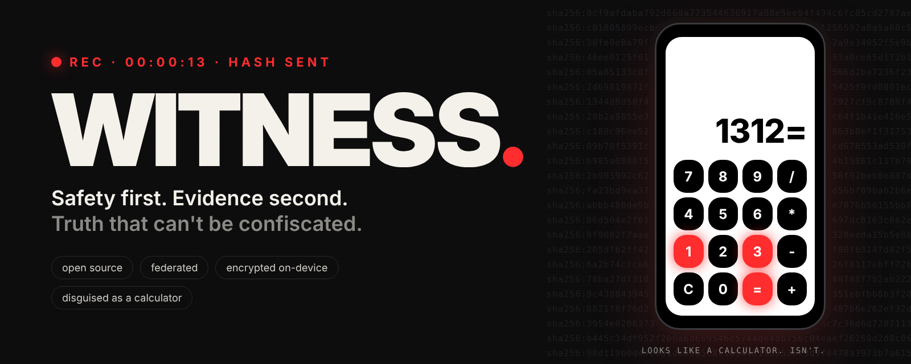
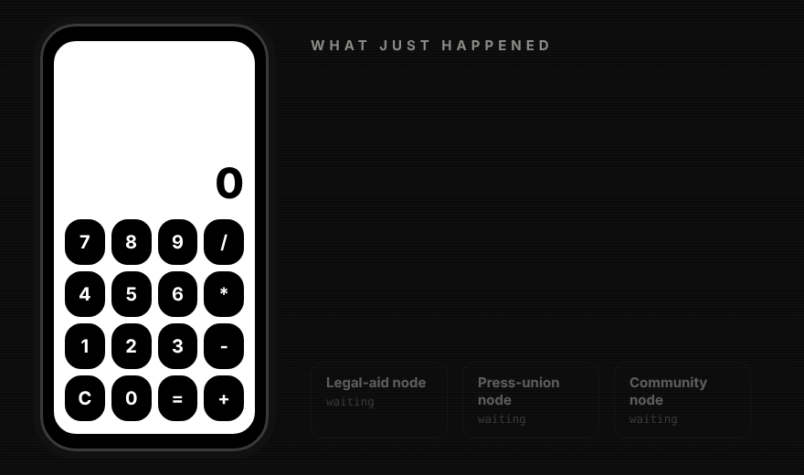
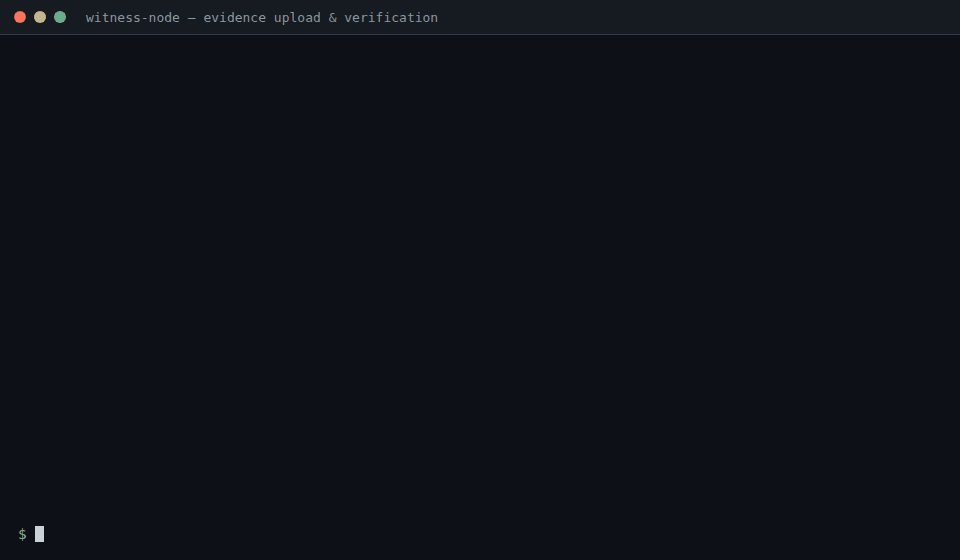
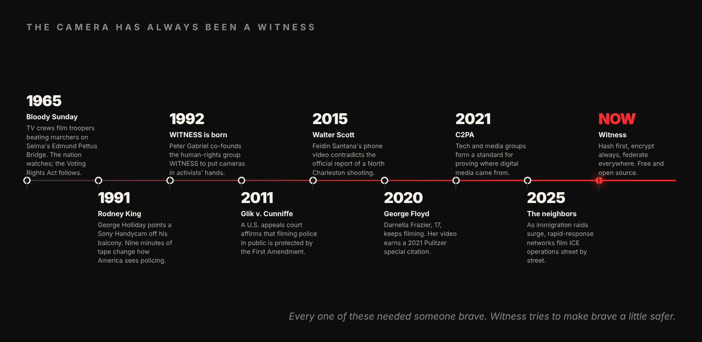
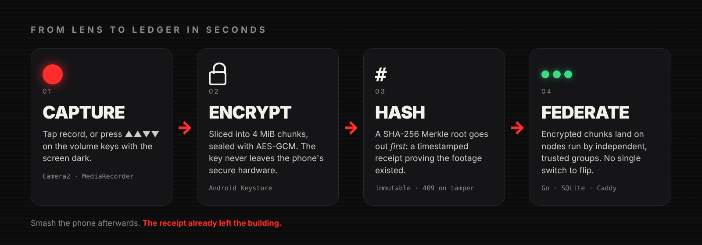
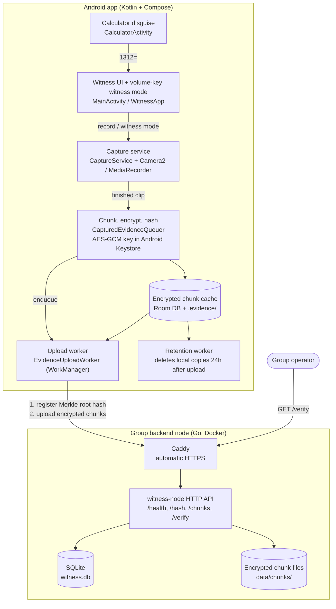
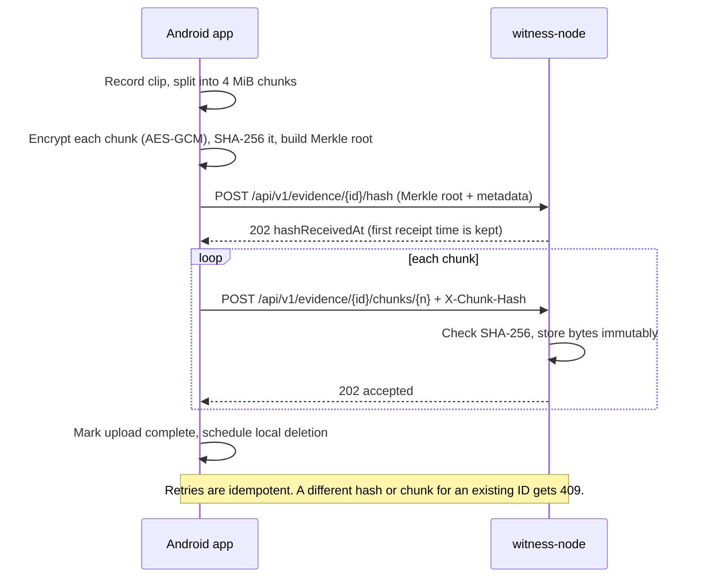

<p align="center">
  
</p>

<p align="center">
  <b>Open-source, federated video evidence for people who film the powerful.</b><br>
  <sub>Initial focus: documenting ICE enforcement actions. Built so that the footage survives, even if the phone doesn't.</sub>
</p>

<p align="center">
  <a href="LICENSE"></a>
  
  
  
  
</p>

---

> **The phone in your pocket is the most important accountability tool ever made.**
> It's also easy to grab, smash, or wipe in about four seconds.
> Witness is built for those four seconds.

When something is happening on your street, you shouldn't have to choose between staying safe and making a record. Witness looks like a calculator. Type `1312=` and it becomes a recorder that **encrypts every chunk as it's captured** and, the moment you hit stop, **sends a cryptographic receipt off the device before the video itself even starts uploading**. If the phone gets taken, the proof that the footage existed has already left.

**Safety first. Evidence second.** That order isn't up for negotiation. Every design decision in this repo gets checked against it.

---

## ▶ See it move

<p align="center">
  
</p>

<sub>Calculator → recorder → encrypted chunks → hash receipt. The last step, replication across several community nodes, shows where this is heading: today a clip goes to one group's node, and multi-node federation is designed but not built yet ([design doc](docs/design/federation-replication.md)).</sub>

And here's a real node answering. These are real responses from a local `witness-node`. Note the forged second hash getting a flat `409`:

<p align="center">
  
</p>

---

## 📼 A short history of the camera as witness

<p align="center">
  
</p>

**1965. The country sees Selma.** On "Bloody Sunday," state troopers attack voting-rights marchers on the Edmund Pettus Bridge. Network news crews are rolling. The footage interrupts prime-time TV, public outrage follows, and the Voting Rights Act passes that summer. Cameras were heavy and rare then, so a few professionals carried the weight.

**1991. A plumber with a camcorder.** George Holliday hears a commotion outside his LA apartment and grabs his new Sony Handycam. His few minutes of grainy tape of officers beating Rodney King become one of the most consequential home videos ever shot. For the first time, an ordinary bystander's footage forces a national reckoning.

**1992. The idea gets a name.** Inspired in part by that tape, musician Peter Gabriel co-founds the human-rights organization **WITNESS** to put video cameras in the hands of activists worldwide. *(We share the word and the conviction. This project is independent and not affiliated with them. Go support their work.)*

**2011. The law catches up.** In *Glik v. Cunniffe*, a federal appeals court holds that filming police doing their jobs in public is protected by the First Amendment. Other circuits follow. The right to record becomes settled law in much of the U.S.

**2015. The report vs. the phone.** Feidin Santana films a North Charleston officer shooting Walter Scott in the back. The video contradicts the initial police account, and a murder charge follows.

**2020. Seventeen and unflinching.** Darnella Frazier keeps her phone steady outside Cup Foods in Minneapolis for nearly ten minutes while George Floyd is killed. Her video sparks protests on every continent and earns a Pulitzer Prize special citation in 2021.

**2021. Provenance gets standardized.** Media and tech groups form the **C2PA** to define how digital media can prove where it came from. Witness tracks this work closely ([compatibility notes](docs/research/c2pa-compatibility.md)).

**2025 → now. The neighbors.** As immigration enforcement surges, rapid-response networks and ordinary neighbors film ICE operations street by street. The threats are now very concrete: phones grabbed, footage deleted, people identified. **That's the gap Witness exists to close.**

Every frame above needed someone brave and a bit of luck: the tape survived, nobody grabbed the camera, the upload went through. **Witness tries to replace the luck with engineering.**

---

## ⚙️ How it works

<p align="center">
  
</p>

1. **🧮 Hide in plain sight.** The launcher icon is a fully working calculator. Do some sums. Type `1312=` and Witness opens.
2. **🔴 Capture, even blind.** Tap record, or use **Witness mode**: press **Volume ▲ ▲ ▼ ▼** with the phone in your pocket. A short buzz means it's armed, and you get **5 seconds** to cancel with Volume ▼ before it starts recording covertly.
3. **🔒 Encrypt immediately.** The clip is cut into 4 MiB chunks, each sealed with AES-GCM under a key that lives in Android Keystore. The plaintext recording is deleted.
4. **#️⃣ Hash first, upload second.** A SHA-256 Merkle root over the encrypted chunks goes to the node **before** the video itself. That timestamped receipt proves the footage existed and hasn't changed since.
5. **📡 Push it out.** WorkManager uploads the chunks with backoff and retries, and survives dead zones and reboots. Each chunk is checked against its hash on arrival.
6. **🧾 Make it permanent.** Nodes treat hashes and chunks as **write-once**. Retries are idempotent; anything trying to swap in different bytes gets `409 Conflict`.
7. **🧹 Leave no trace.** Once the upload is confirmed, local encrypted copies are deleted after 24 hours.

### The plumbing





| Component | Where | What it does |
|-----------|-------|--------------|
| Calculator disguise | `android/.../ui/camouflage/` | Launcher shows a working calculator; `1312=` opens Witness |
| Witness mode | `android/.../MainActivity.kt`, `domain/safety/` | Volume Up, Up, Down, Down arms covert recording; Volume Down cancels within 5 seconds |
| Capture | `android/.../service/capture/` | Foreground service recording video or audio, switching to audio-only on low battery |
| Encryption and hashing | `android/.../data/upload/CapturedEvidenceQueuer.kt`, `domain/verification/` | Chunks, encrypts, and hashes the clip, then deletes the plaintext recording |
| Upload and retention | `android/.../data/upload/` | WorkManager jobs that upload with backoff and clean up after confirmation |
| Backend node | `backend/` | Go HTTP API storing hashes, metadata, and encrypted chunks in SQLite and on disk |
| Deployment | `docker-compose.yml`, `deploy/` | Docker Compose with Caddy for HTTPS, plus a DigitalOcean cloud-init reference |

---

## ✅ What works today vs. 🛣️ what's coming

We'd rather you trust us than be impressed by us, so here's exactly where things stand.

| | Feature | Status |
|---|---|---|
| 🧮 | Calculator camouflage with `1312=` unlock | ✅ Works |
| 🔴 | Video recording via foreground service | ✅ Works |
| 🫥 | Witness mode (▲▲▼▼ volume sequence, 5-second cancel window) | ✅ Works while the app is open |
| 🔋 | Audio-only below 15% battery; graceful stop at 5% | ✅ Works |
| 🔒 | Per-chunk AES-GCM encryption, Keystore-held key | ✅ Works |
| #️⃣ | SHA-256 chunk hashes + Merkle root, registered before upload | ✅ Works |
| 📡 | Offline-tolerant upload queue with retry/backoff | ✅ Works |
| 🧾 | Write-once hash + chunk storage on a group node (`409` on tamper) | ✅ Works |
| 🐳 | One-command Docker + Caddy HTTPS node for a group | ✅ Works |
| 🌐 | Multi-node federation & replication | 🛣️ [Designed](docs/design/federation-replication.md), not built |
| 📺 | Live streaming | 🛣️ Planned |
| 🎭 | Switchable disguises (weather, notes…) | 🛣️ Planned |
| 🎞️ | Evidence playback / sharing with lawyers | 🛣️ Planned |
| 🏷️ | C2PA provenance export | 🛣️ [Researching](docs/research/c2pa-compatibility.md) |

---

## 🛡️ Threat model

Witness is designed for a bad day. It aims to protect against:

- **Device seizure or destruction.** The hash receipt and encrypted chunks are already off the device.
- **Footage deletion.** Nodes are write-once, and a conflicting re-upload is refused.
- **Server takedowns.** Federation spreads evidence across independent operators (roadmap).
- **Network blocking.** Uploads queue and retry until a path opens.
- **Identification and retaliation.** Disguised launcher, covert mode, no required account.

What it is **not**: a substitute for legal advice, a security plan, or common sense. If you are in danger, leave. Footage can be replaced and you can't.

> ⚖️ **Know your rights.** In much of the U.S., filming police and federal agents performing their duties in public is protected by the First Amendment, but specifics vary by place and situation. Keep a safe distance, don't interfere, and talk to a local legal-aid or rapid-response group.

---

## 📲 Using the app

The app launches as a calculator. To open Witness, enter:

```text
1312=
```

### Download an APK

Pre-alpha APKs may be attached to [GitHub Releases](https://github.com/ChrisBrooksbank/witness/releases) for trusted testing.

- Install only APKs from official Witness releases.
- Verify the `.sha256` checksum when possible.
- GitHub APK installs do not provide app-store-style update management.
- A group APK must be built with that group's HTTPS backend URL.
- Pre-alpha APKs are not a substitute for legal advice or organizational security planning.

See [docs/releases/apk-distribution.md](docs/releases/apk-distribution.md) for the release process and signing requirements.

---

## 🏠 Run a node for your group

A Witness node is meant to feel like setting up a small appliance, not like becoming a backend engineer. Legal-aid groups, press unions, and community orgs can each run one on a small VPS.

The node stores **encrypted** evidence chunks and verification metadata. It can confirm receipt and verify uploaded chunks, but the operator can't casually watch the footage, and there is no playback interface yet.

**You need:** a domain (e.g. `witness.example.org`), a small Ubuntu VPS with SSH, and Docker + Docker Compose.

**1. Point your domain** at the server: add an `A` record for `witness.example.org` → your VPS IP.

**2. Configure:**

```bash
cp .env.example .env
```

Set `WITNESS_SERVER_NAME` to your domain. The default `WITNESS_DATA_DIR=./data` stores the SQLite database and encrypted chunks beside the compose file.

**3. Launch with automatic HTTPS:**

```bash
docker compose up -d
curl https://witness.example.org/health
# {"status":"ok"}
```

For local emulator testing without HTTPS, leave `.env` absent or remove `COMPOSE_PROFILES=https` from it, then `curl http://localhost:8080/health`. Use `http://` only for emulator and local development. The compose file binds port `8080` to server-local `127.0.0.1`, so real phone uploads should go through Caddy over HTTPS.

**4. Point the app at it.** Debug builds default to the emulator URL `http://10.0.2.2:8080/`. Group builds must set theirs:

```bash
cd android
./gradlew assembleRelease -PwitnessNodeBaseUrl=https://witness.example.org/
```

The release build refuses a URL that is missing, uses the emulator/localhost default, isn't HTTPS, or lacks the trailing slash.

**5. Record a test clip.** Install the group build, open the calculator, enter `1312=`, record a short clip, and wait for upload. The queue retries when connectivity is unavailable.

**6. Confirm receipt:**

```bash
curl https://witness.example.org/api/v1/evidence/{evidenceId}/verify
```

The response includes upload and verification state plus `encryptedBytesStored` for each chunk, so operators can confirm the encrypted bytes are still on disk after a restart. Registered hashes and stored chunks are immutable. Retrying the same upload is safe and returns the original receipt time; a different hash or chunk for an existing evidence ID gets `409 Conflict`. Evidence ID discovery in the app UI is still early, so use Android logs while testing for now.

### Backups

The container fixes ownership of `./data` on start, so either Docker or you can create it. **Back up `./data`.** It contains `witness.db` and the encrypted chunk files, and losing it may lose evidence. Test a restore before relying on a deployment.

### Troubleshooting

- `/health` won't load → `docker compose ps` and `docker compose logs witness-backend`.
- No HTTPS certificate → confirm the `A` record points at the server and ports `80`/`443` are reachable.
- App queue stays pending → confirm the Android build uses the same HTTPS base URL you're checking.
- Uploads fail → check the server disk isn't full and `./data` is writable by Docker.

### Operator safety

Protect SSH keys, Docker access, backups, and admin accounts like they matter, because they do. Witness is not a substitute for legal advice or organizational security planning.

---

## 🧑‍💻 Hacking on Witness

| Layer | Stack |
|---|---|
| Android | Kotlin, Jetpack Compose, Camera2, WorkManager, Room, Android Keystore |
| Node | Go `net/http`, SQLite (`modernc.org/sqlite`), Docker, Caddy |
| Quality gates | ktlint, detekt, unit tests, `go vet`, golangci-lint, APK < 15 MB |

```bash
./scripts/check.sh            # every quality gate
./scripts/check.sh android    # Android only
./scripts/check.sh backend    # Go only
./scripts/install-hooks.sh    # pre-commit checks
```

The project is built with the **Ralph Wiggum Loop**, an AI-assisted plan → build → validate cycle:

```bash
./loop.sh plan   # generate the implementation plan from specs/
./loop.sh        # implement one task per iteration
```

The full requirements live in [`specs/`](specs/readme.md), progress in [`IMPLEMENTATION_PLAN.md`](IMPLEMENTATION_PLAN.md), and changes in [`CHANGELOG.md`](CHANGELOG.md). Methodology notes are in [specs/ralph.md](specs/ralph.md), and the plan for making node setup appliance-simple is in [docs/design/group-backend-setup-plan.md](docs/design/group-backend-setup-plan.md).

### Contributing

Early days, and every kind of help counts: Android, Go, security review, UX for stressful moments, translations (Spanish strings are already in), legal research, or just running a test node and telling us what broke. Open an issue and say hi.

**One rule above all:** never trade the user's safety for better evidence. And changes to hash generation need explicit sign-off, because evidence integrity is the whole point.

---

<p align="center">
  <b>Witness is a public good, not a product.</b><br>
  <sub>MIT licensed · not for profit · built for the people holding the phone.</sub><br><br>
  
</p>
